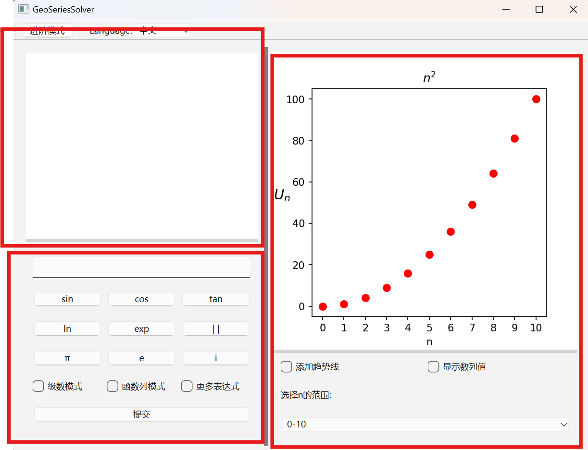
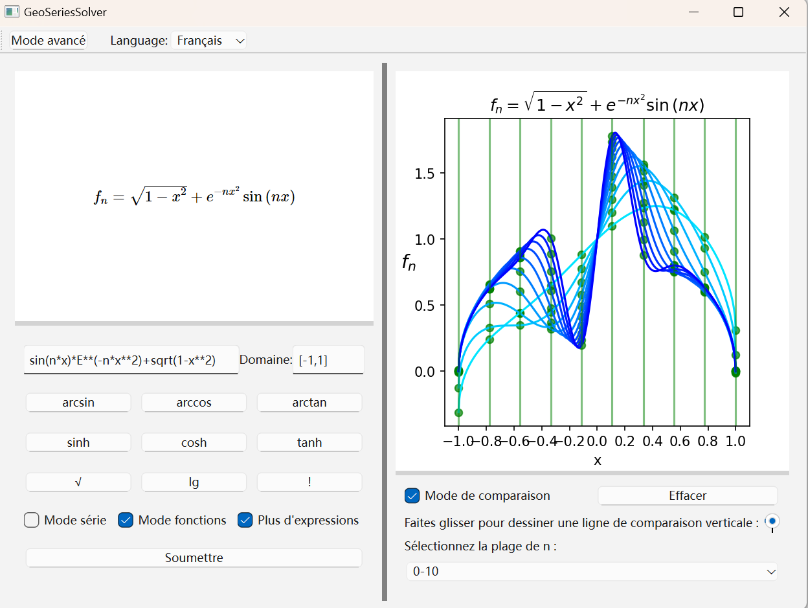
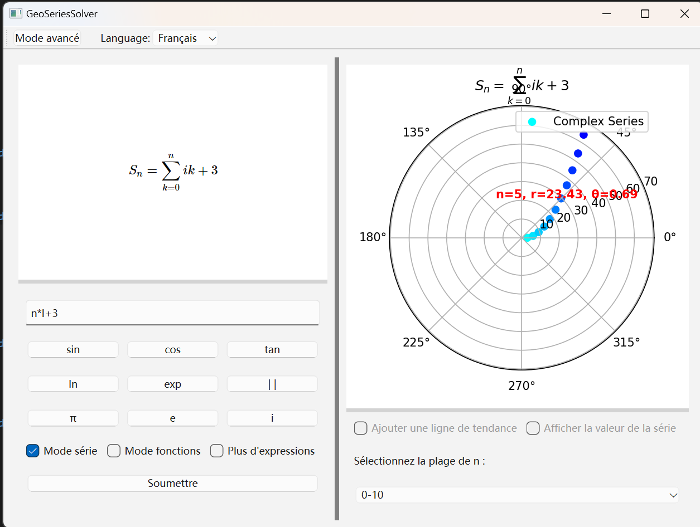
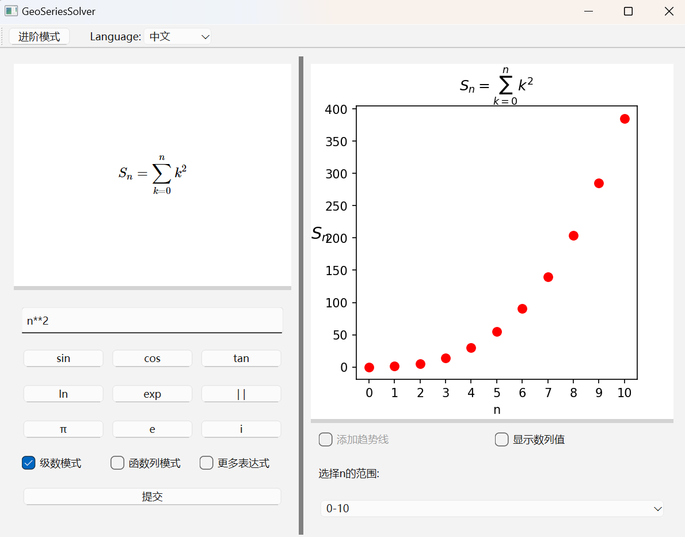
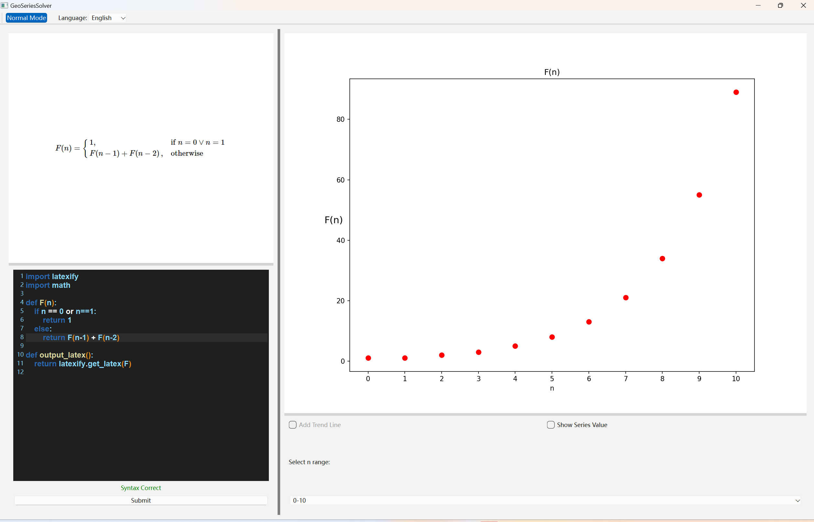

# GeoSeriesSolver

基于 PyQt6 开发的交互式数学可视化分析工具，专精于数列、级数与函数列的动态演算与教学演示，支持中文、英文、法语多语言界面。

## 项目概览
  
*界面三大核心模块：*  
- **LaTeX 公式渲染区**：实时呈现数学表达式的专业排版  
- **智能表达式输入器**：支持自然语法与编程式输入  
- **动态可视化画布**：生成可交互的数学图形与动画演示  
*（各区域支持拖拽调整尺寸，适配不同显示需求）*

## 核心功能解析

### ▶ 函数列分析模式
  
- 支持对比函数列在不同n下的表现,便于判断其收敛方式

### ▶ 复数解析模式
  
- 自动检测虚数单位 **I** 触发模式切换  
- 通过极坐标进行映射

### ▶ 级数分析模式
  
- 兼容函数列模式或复数模式

### ▶ 进阶模式
  
- 嵌入式 Python 代码编辑器（支持语法高亮和语法检测）  
- 自定义递推数列与高阶数列编程  

---

## 使用说明

1. **部署要求**  
   - Windows 10+ 系统  
   - [Release] 采用分卷压缩，需下载全部10个压缩包后解压  
   - 首次启动需初始化数学引擎，约需10秒

2. **交互规范**  
   - LaTeX 渲染依赖在线服务，请保持网络连接  
   - 变量命名规范：  
     - 离散序列：`n` / `k`  
     - 连续变量：`x`  
     - 特殊常量：`E` (自然对数底) / `I` (虚数单位) 须大写

3. **bug反馈**  
   如遇功能异常或界面显示问题，请通过 Issues 提交

